# Hadoop - HDFS
## Curso Citizen Data Scientist - CAOBA
### Profesor: Edwin Montoya M. – emontoya@eafit.edu.co
## 2018

# Laboratorio HDFS

## 1. CONEXIÓN AL CLUSTER

Ambari Web

    https://hortonX.dis.eafit.edu.co (reemplace X por el numero de servidor asignado)

Terminal:

    https://shellX.dis.eafit.edu.co (reemplace X por el numero de servidor asignado)

Usuarios:

    username: cds##cali
    password: <enviado por email>

## 2. GESTIÓN DE ARCHIVOS EN HDFS VÍA TERMINAL

1. Cargar los datos de los datasets de trabajo del curso en HDFS 
2. Cada alumno creara en hdfs un directorio 'datasets'
3. En ese 'datasets' los archivos ya deben estar descomprimidos para ser procesables.
4. Datasets: [DATASETS](../datasets)

### Listar archivos HDFS

Para efectos de esta guia, es equivalente el comando "hadoop fs" y "hdfs dfs". La diferencia es que "hdfs dfs" es solo para sistemas de archivos HDFS, pero "hadoop fs" soporta otros adicionales como S3.

    user@master$ hdfs dfs -ls /
    user@master$ hdfs dfs -ls /user
    user@master$ hdfs dfs -ls /user/<username>
    user@master$ hdfs dfs -ls /datasets

### Crear tu propio directorio de 'datasets' en HDFS

    user@master$ hdfs dfs -mkdir /user/<username>
    user@master$ hdfs dfs -mkdir /user/<username>/datasets

Nota: reemplace “<username>” por aca usuario asignado

### Copiar archivos locales (al servidor gateway) hacia HDFS

Se asume que tiene los datos LOCALES se encuentran en /datasets
Tambien están en este github, y por terminal debería copiarlos por SSH/SCP al servidor Gateway por la VPN (no disponible para este curso)
Lo podrá hacer desde su PC vía Ambari Web 

    user@master$ hdfs dfs -mkdir /user/<username>/datasets
    user@master$ hdfs dfs -mkdir /user/<username>/datasets/gutenberg-small

    user@master$ hdfs dfs -put /datasets/gutenberg/gutenberg-small.zip /user/<username>/datasets/

    (realmente los archivo .zip en hdfs no son procesables, deberán subir los archivos descomprimidos, como lo hacen?)

otro comando para copiar:

    Descomprima los datos .zip en un dir local (al GATEWAY), clone el repo.

    user@master$ cd ~$HOME/caobacds2018/datasets/gutenberg/
    user@master$ unzip gutenberg-small.zip

    En general, descomprima todos los archivos del dataset que quiera procesar en Hadoop/Spark.
    
    user@master$ hdfs dfs -copyFromLocal /datasets/* /user/<username>/datasets/

listar archivos: 

    user@master$ hdfs dfs -ls /user/<username>/datasets
    user@master$ hdfs dfs -ls /user/<username>/datasets/gutenberg-small/

### Copiar archivos de HDFS hacia el servidor local (gateway)

    user@master$ hdfs dfs -get /user/<username>/datasets/gutenberg/gutenberg-small.zip ~<username>/mis_datasets/    (el directorio 'mis_datasets' debe estar creado)

otro comando para traer:

    user@master$ hdfs dfs -copyToLocal /user/<username>/datasets/gutenberg/gutenberg-small.zip ~<username>/mis_datasets/

    user@master$ ls -l mis_datasets

### Probar otros commandos

Se aplica los siguientes comandos a:

    user@master$ hdfs dfs -<command>

comandos:

    du <path>             uso de disco en bytes
    mv <src> <dest>       mover archive(s)
    cp <src> <dest>       copiar archivo(s)
    rm <path>             borrar archive(s)
    put <localSrc> <dest-hdfs> copiar local a hdfs
    cat <file-name>       mostrar contenido de archivo
    chmod [-R] mode       cambiar los permisos de un archivo
    chown <username> files   cambiar el dueño de un archivo
    chgrp <group> files      cambiar el grupo de un archivo

## 3. EXTRACCIÓN DE DATOS DESDE RDBMS VIA SQOOP HACIA HDFS

## 4. GESTIÓN DE ARCHIVOS VÍA AMBARI WEB

* Login

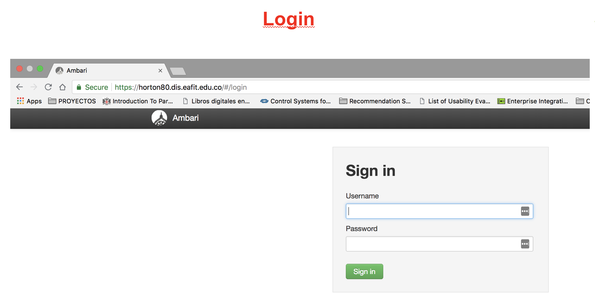

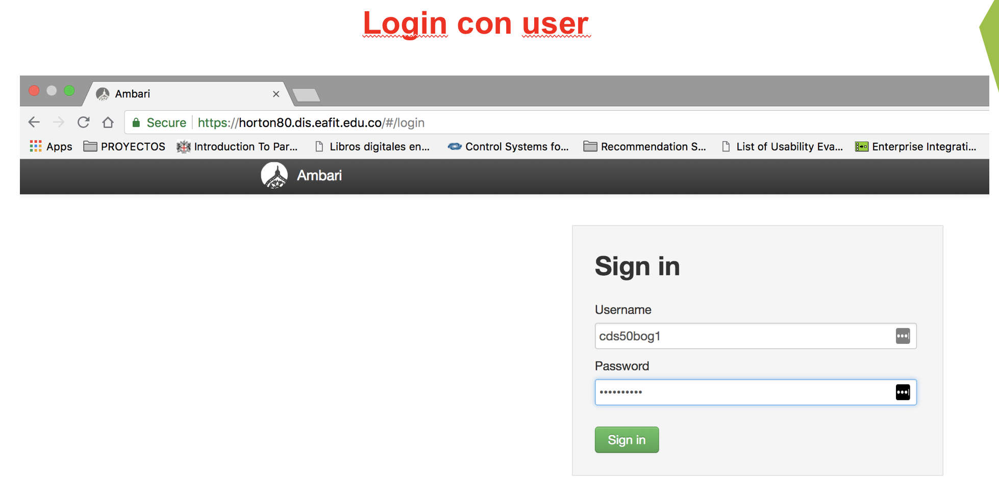

![login]ambari/Ambari-hdfs-03.png)

* Opciones de usuario

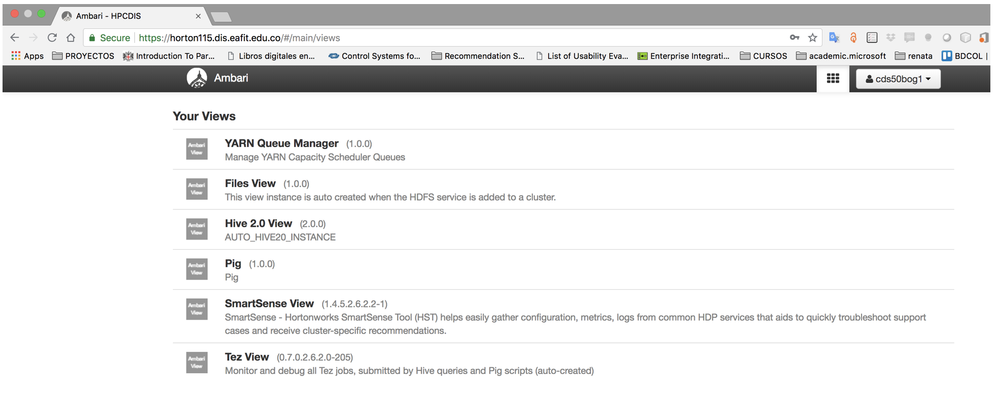

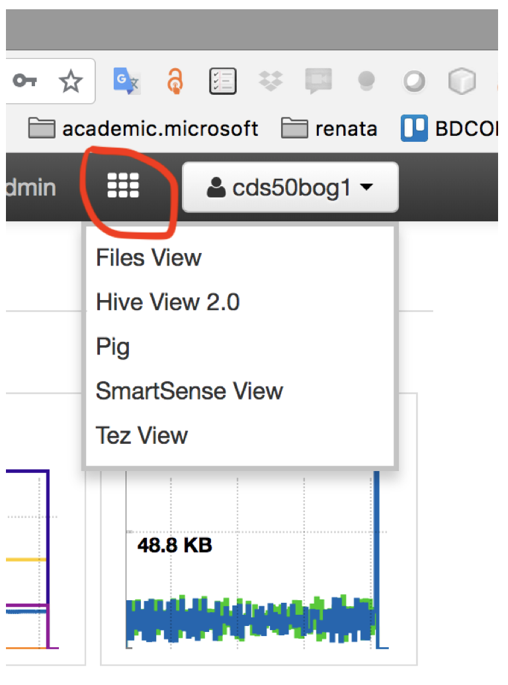

* Listar directorio Home del usuario

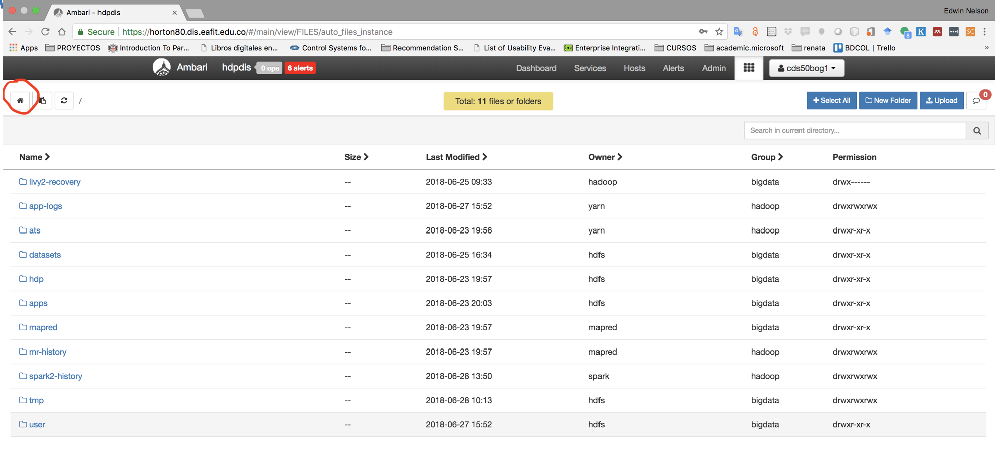

* Crear un directorio

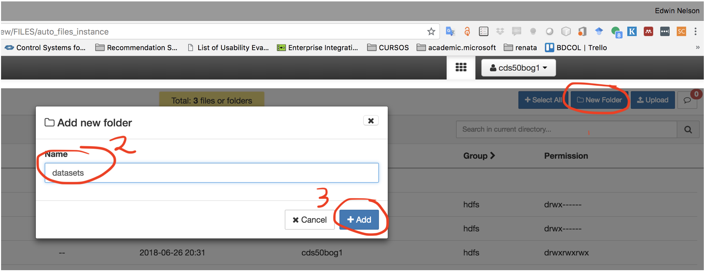

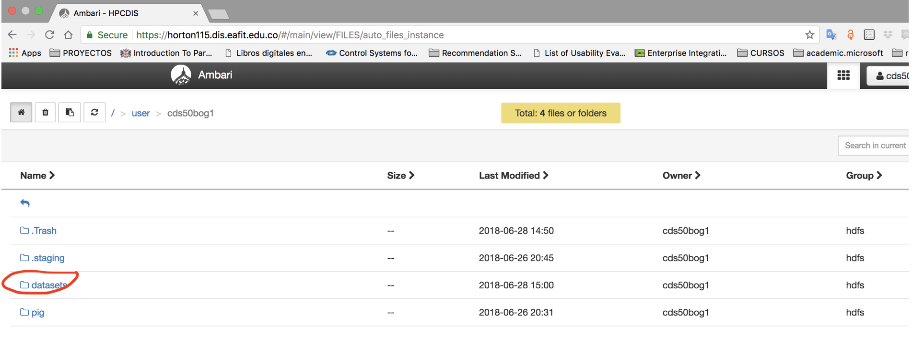

* Subir (upload)  un directorio

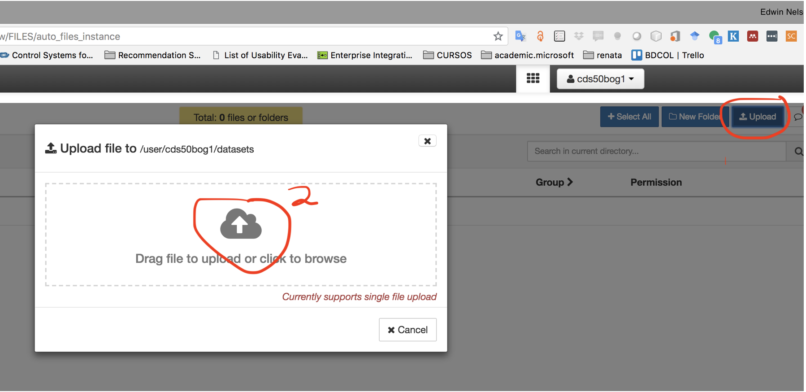

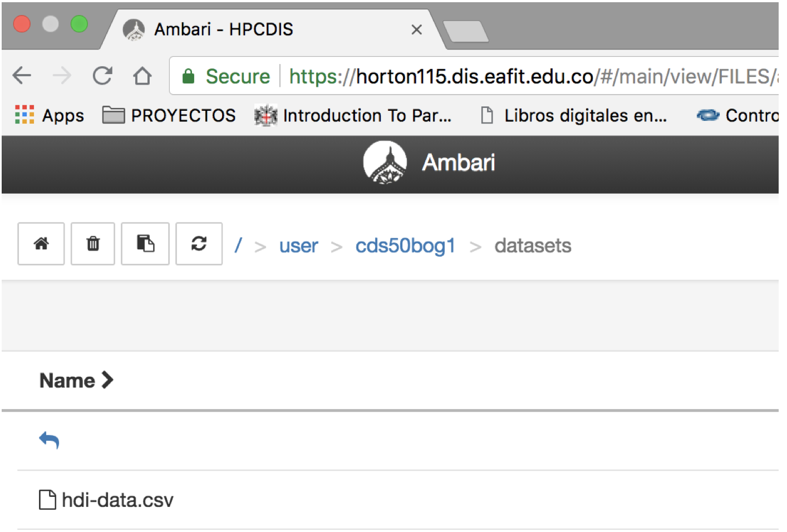

* Cambiar permisos de archivo o directorio

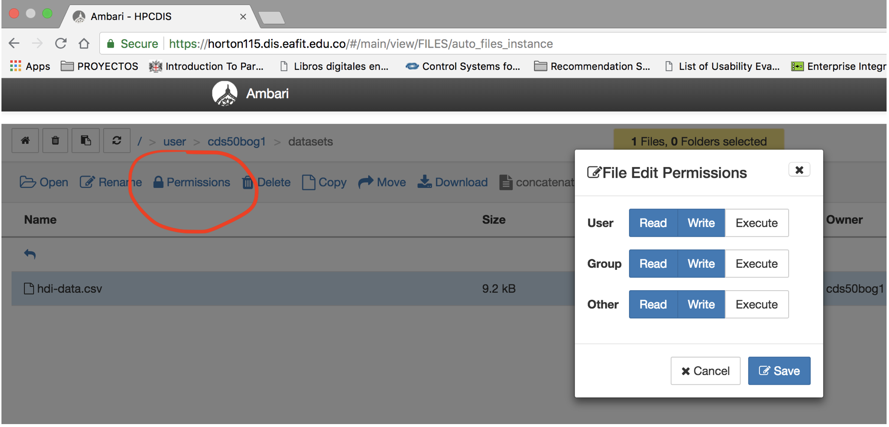

* Ver contenido de un archivo

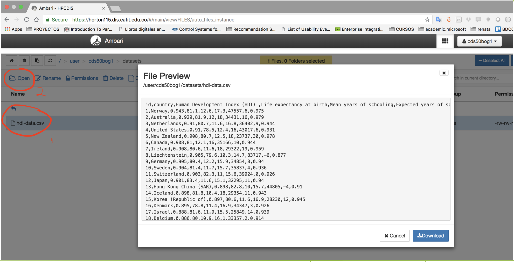