# Hadoop - HDFS
## Curso Citizen Data Scientist - CAOBA
### Profesor: Edwin Montoya M. – emontoya@eafit.edu.co
## 2018

# HIVE

## TABLAS SENCILLAS EN HIVE

## 1. Conexión al cluster Hadoop

Ambari Web

    https://hortonX.dis.eafit.edu.co (reemplace X por el numero de servidor asignado)

Terminal:

    https://shellX.dis.eafit.edu.co (reemplace X por el numero de servidor asignado)

Usuarios:

    username: cds##cali
    password: <enviado por email>

## 2. Los archivos de trabajo hdi-data.csv y export-data.csv

```
/user/<username>/datasets/onu
```

## 3. Gestión y Consultas vía Terminal

1. ejecutar Hive:

```
$ beeline
beeline> !connect jdbc:hive2://<server-hive>:2181/;serviceDiscoveryMode=zooKeeper;zooKeeperNamespace=hiveserver2

o

beeline> !connect jdbc:hive2://127.0.0.1:2181/;serviceDiscoveryMode=zooKeeper;zooKeeperNamespace=hiveserver2

o

beeline> !connect jdbc:hive2://sandbox-hdp.hortonworks.com:2181/;serviceDiscoveryMode=zooKeeper;zooKeeperNamespace=hiveserver2
```

2. Crear la base de datos

```
beeline> create database cds##cali;
```

3. Crear la tabla HDI en Hive:
```
beeline> use <username>;
beeline> CREATE TABLE HDI (id INT, country STRING, hdi FLOAT, lifeex INT, mysch INT, eysch INT, gni INT) ROW FORMAT DELIMITED FIELDS TERMINATED BY ',' STORED AS TEXTFILE;
```

Nota: Esta tabla la crea en una BASE DE DATOS 'cds##cali'
```
beeline> use cds##cali;
beeline> show tables;
beeline> describe hdi;
```

4. cargar los datos desde el Gateway (local) a la tabla HDI:

```
beeline> load data local inpath '/home/cds##cali/datasets/onu/hdi-data.csv' into table HDI;
```

cargar datos desde el HDFS:

```
beeline> load data inpath '/user/<username>/datasets/onu/hdi-data.csv' into table HDI;
```

5. hacer consultas y cálculos sobre la tabla HDI:
```
beeline> select * from hdi;
beeline>
beeline> select country, gni from hdi where gni > 2000;    
beeline>
```

### EJECUTAR UN JOIN CON HIVE:

1. Obtener los datos base: export-data.csv

usar los datos en 'datasets' de este repositorio.

2. Iniciar hive y crear la tabla EXPO:

```
$ beeline
beeline> use <username>;
beeline> CREATE TABLE EXPO (country STRING, expct FLOAT) ROW FORMAT DELIMITED FIELDS TERMINATED BY ',' STORED AS TEXTFILE;
```

3. Carga los datos:export-data.csv
```
beeline>LOAD DATA LOCAL INPATH 'export-data.csv' INTO TABLE EXPO;
```

4. EJECUTAR EL JOIN DE 2 TABLAS:
```
beeline> SELECT h.country, gni, expct FROM HDI h JOIN EXPO e ON (h.country = e.country) WHERE gni > 2000;
```


### WORDCOUNT EN HIVE:
```
beeline> use <username>;
beeline>CREATE EXTERNAL TABLE docs (line STRING) STORED AS TEXTFILE LOCATION '/user/cds##cali/datasets/gutenberg/gutenberg-small/';
```

// ordenado por palabra
```
beeline>SELECT word, count(1) AS count FROM (SELECT explode(split(line,' ')) AS word FROM docs) w GROUP BY word ORDER BY word;
```
// ordenado por frecuencia de menor a mayor
```
beeline>SELECT word, count(1) AS count FROM (SELECT explode(split(line,' ')) AS word FROM docs) w GROUP BY word ORDER BY count;
```

RETO:

¿cómo llenar una tabla con los resultados de un Query? por ejemplo, como almacenar en una tabla el diccionario de frecuencia de palabras en el wordcount?

// TENER EN CUENTA LA CARGA LOCAL o DESDE EL HDFS de los DATOS a HIVE:

## 3. Gestion y Consultas desde Ambari Web - Hive View

* Inicio

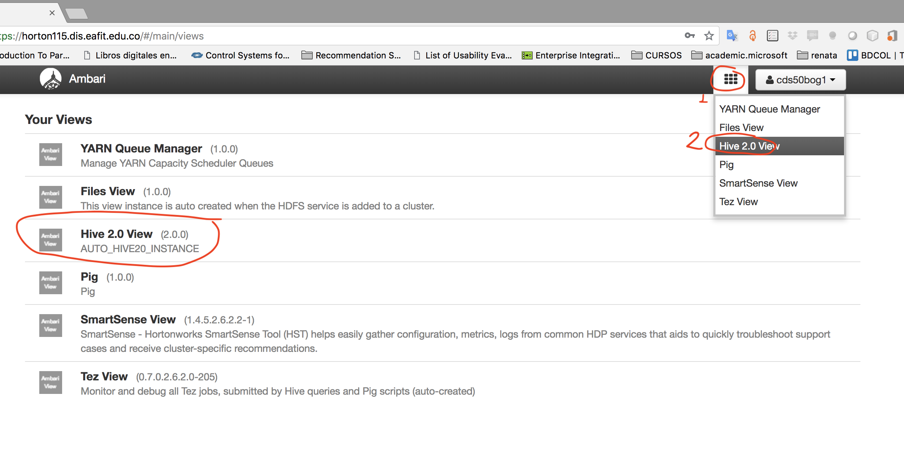

* Consultas

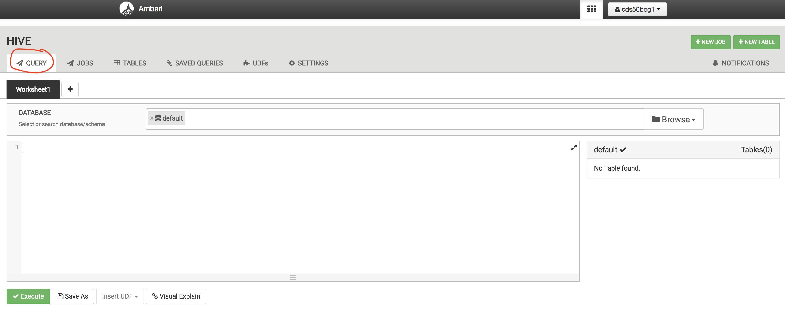

* crear base de datos

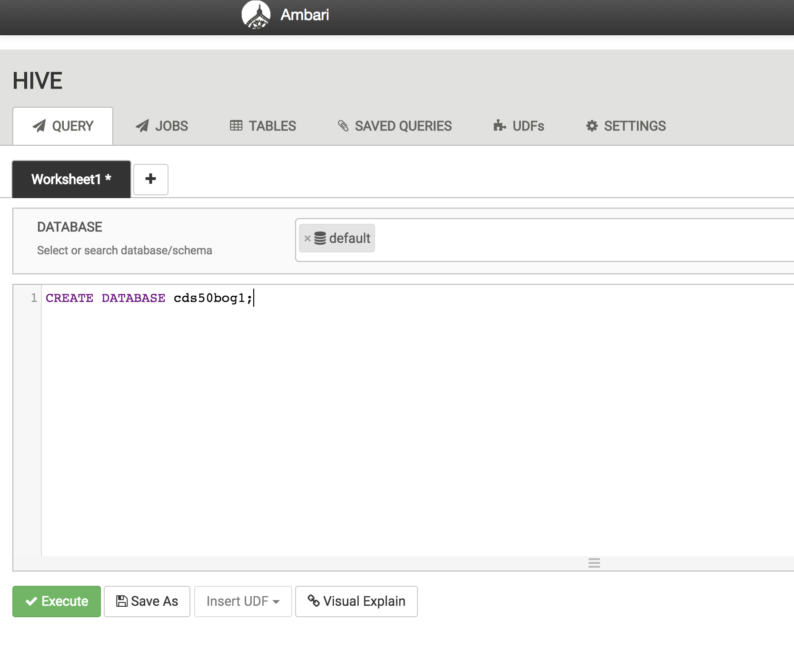
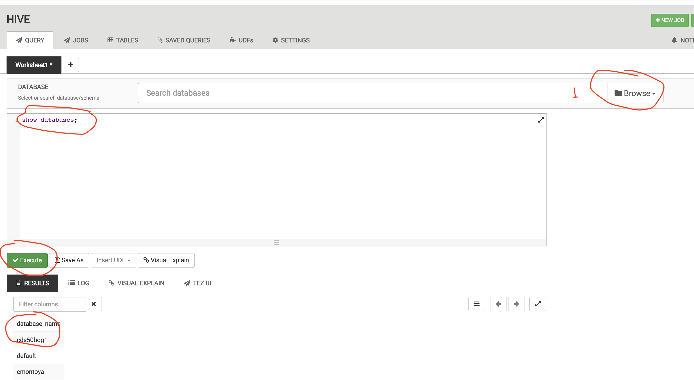
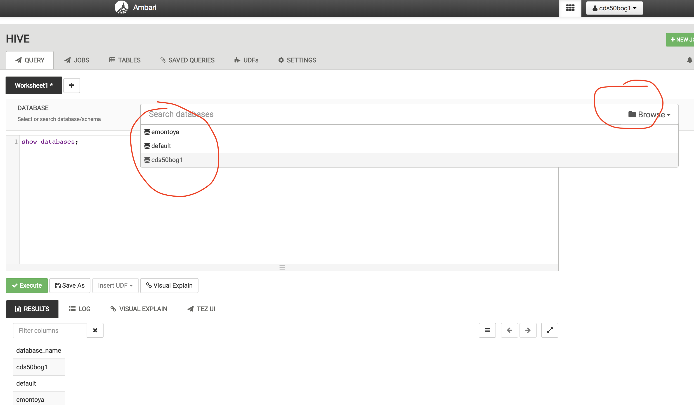
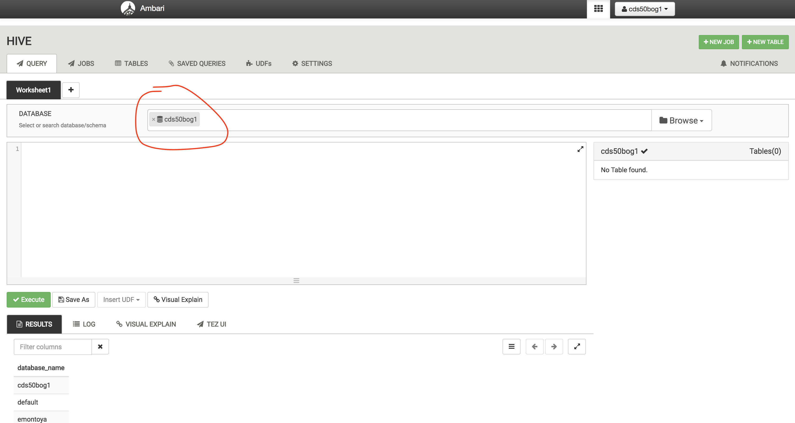
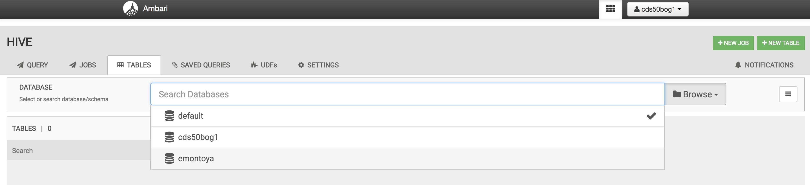

* tablas de una base de datos

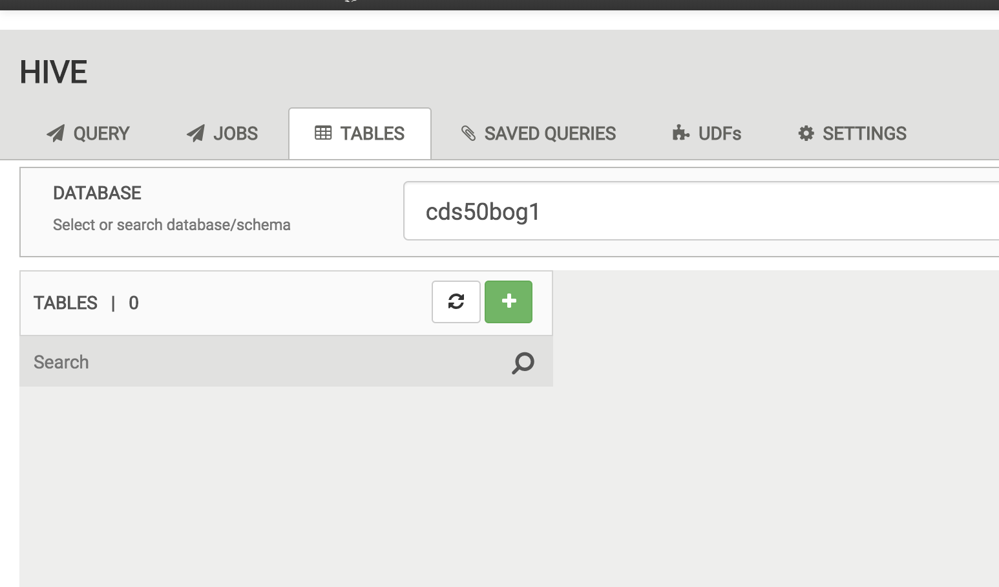

* crear tabla de una base de datos

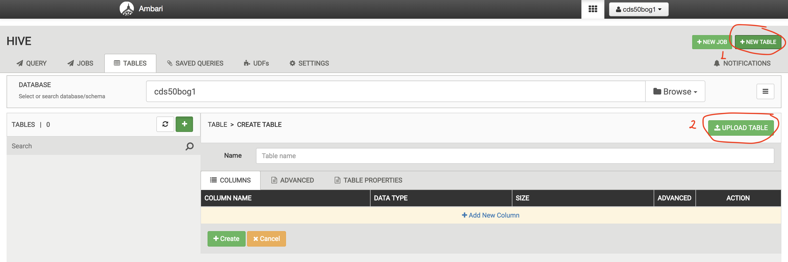

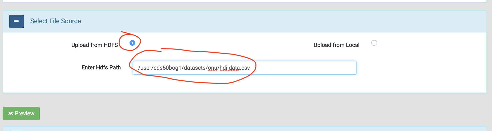
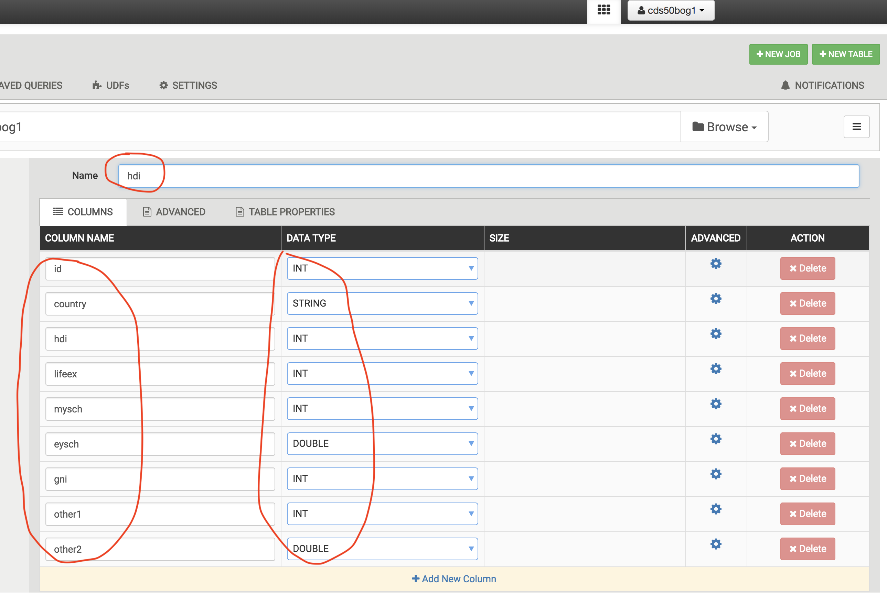

* descripción tabla tabla hdi

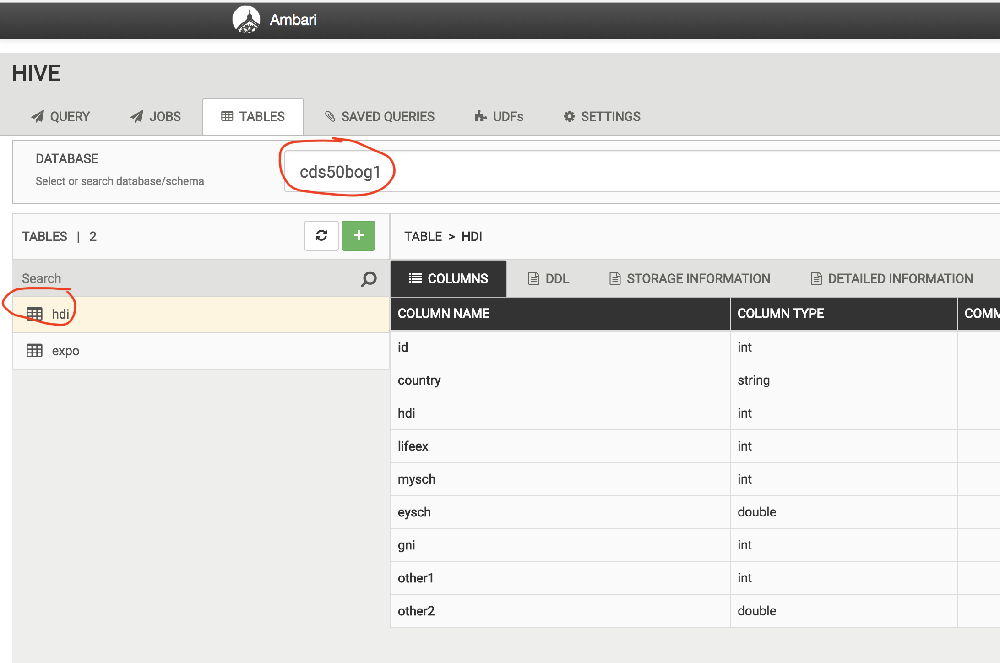

* descripción tabla tabla expop


# Apache Sqoop

## Datos en MySQL

```
En 192.168.10.80, se tiene Mysql con:
Base de datos: “cursodb”
Tabla: “employee” (ya existe una table llamada 'employee')
User: curso/curso
$ mysql –u curso –p
Enter password: ******
mysql> use cursodb;
```

## Comandos Sqoop

//Transferir datos de una base de datos (tipo mysql) hacia HDFS:
```
$ sqoop import --connect jdbc:mysql://127.0.0.1:3306/cursodb --username curso -P --table employee --target-dir /user/username/mysqlOut -m 1
```

// listar archivos:
```
$ hdfs dfs -ls /user/username/mysqlOut
```

// Crear tabla HIVE a partir de definición tabla Mysql:
```
$ sqoop create-hive-table --connect jdbc:mysql://127.0.0.1:3306/cursodb --username curso -P --table employee --hive-database cds##cali --hive-table employee -m 1--mysql-delimiters
```

// Transferir datos de una base de datos (tipo mysql) hacia HIVE vía HDFS:

```
$ sqoop import --connect jdbc:mysql://127.0.0.1:3306/cursodb --username curso -P --table employee --hive-import --hive-database cds##cali --hive-table employee -m 1 --mysql-delimiters
```

// Transferir todas las tablas de una base de datos (tipo mysql) hacia HIVE vía HDFS:

```
sqoop import-all-tables --connect jdbc:mysql://127.0.0.1:3306/retail_db --username=retail_dba --password=caoba --warehouse-dir /user/emontoya/mysqlOut1 --mysql-delimiters -m 1

sqoop import-all-tables --connect jdbc:mysql://127.0.0.1:3306/retail_db --username=retail_dba --password=caoba --warehouse-dir=/user/hive/warehouse/emontoya.db/ --hive-import --mysql-delimiters -m 1 

sqoop import-all-tables --connect jdbc:mysql://127.0.0.1:3306/retail_db --username=retail_dba --password=caoba --hive-database emontoya --create-hive-table --warehouse-dir=/user/emontoya/stagemysql1/ --hive-import --mysql-delimiters -m 1 

sqoop import-all-tables --connect jdbc:mysql://127.0.0.1:3306/retail_db --username=retail_dba --password=caoba --hive-database emontoya --hive-overwrite --warehouse-dir=/user/emontoya/stagemysql/ --hive-import --mysql-delimiters -m 1 
```


// Poblar o llenar la tabla Hive Manualmente:
```
$ beeline
beeline> use <username>;
beeline> CREATE TABLE username_emps (empid INT, name  STRING, salary INT) ROW FORMAT DELIMITED FIELDS TERMINATED BY ','  LINES TERMINATED BY '\n' STORED AS TEXTFILE;
beeline>
```
// Cargar datos a Hive Manualmente:
```
beeline> load data inpath '/user/username/mysqlOut/part-m-00000' into table database.username_emps;
OK                          
beeline> select * from username_emps;
OK
101 name1 1800
102 name2 1500
103 name3 1000
104 name4 2000
105 name5 1600
taken: 0.269 seconds, Fetched: 5 row(s) Time
beeline> 
```

//Sqoop export hacia mysql:

// Crear una Tabla 'username_employee2' en Mysql con los mismos atributos de 'username_employee'
```
mysql> USE cursodb;
mysql> CREATE TABLE username_employee2 (  emp_id INT NOT NULL,  name VARCHAR(45),  salary INT,  PRIMARY KEY (emp_id));
```

// Asumiendo datos separados por ”,” en HDFS en:

/user/username/mysql_in/*

```
$ sqoop export --connect jdbc:mysql://127.0.0.1:3306/cursodb --username curso -P --table username_employee2 --export-dir /user/username/mysqlOut
```